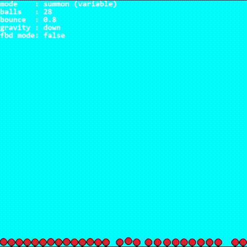

# Ball Studios

A 2D physics simulator built from scratch in **Python** using **Pygame-ce**.



Ball Studios is a project focused on implementing and experimenting with physics systems such as gravity, collisions, friction, bouncing, and object interactions.

## Features

* Multiple physics objects
* Gravity
* Object collisions
* Collision response
* Friction
* Bouncing and restitution
* Velocity and momentum visualization
* Interactive controls
* Configurable physics parameters

## Controls

| Input                 | Action                                  |
| --------------------- | --------------------------------------- |
| `Left Mouse Button`   | Grab objects                            |
| `Middle Mouse Button` | Change gravity to mouse                 |
| `Right Mouse Button`  | Interact with the simulation            |
| `Mouse Scroll`        | Switch interaction mode                 |
| `Arrow Keys`          | Change gravity direction                |
| `f`                   | Toggle Free Body Diagram mode           |
| `Esc`                 | Quit                                    |

> Controls may change as the project develops.

## Getting Started

### Requirements

* Python 3.x
* pygame-ce 2.5.x

### Installation

Clone the repository:

```bash
git clone https://github.com/AryanTheIndoDev/Physics-Simulator.git
cd Physics-Simulator
```

Install the required dependencies:

```bash
pip install -r requirements.txt
```

Run the simulator:

```bash
python main.py
```

## How It Works

Ball Studios implements its physics systems directly rather than relying on a dedicated physics engine.

The simulator handles things such as:

* Position and velocity updates
* Acceleration due to gravity
* Collision detection
* Collision resolution
* Friction
* Bouncing
* Momentum-based interactions

The project is primarily an exploration of how these systems can be implemented and combined into a working physics simulation.

## Showcase


## Future Plans

The project is currently in a usable state, but there is plenty of room for experimentation and improvement.

Possible future additions include:

* More accurate collision handling
* Improved friction and rolling physics
* Additional object types
* Better visualization of physical quantities
* Performance improvements
* Additional simulation tools

## Built With

* **Python**
* **Pygame-ce**

## Author

**Aryan**

GitHub: [AryanTheIndoDev](https://github.com/AryanTheIndoDev)

---

*Ball Studios is a personal project built to learn, experiment, and have fun with physics and programming.*
